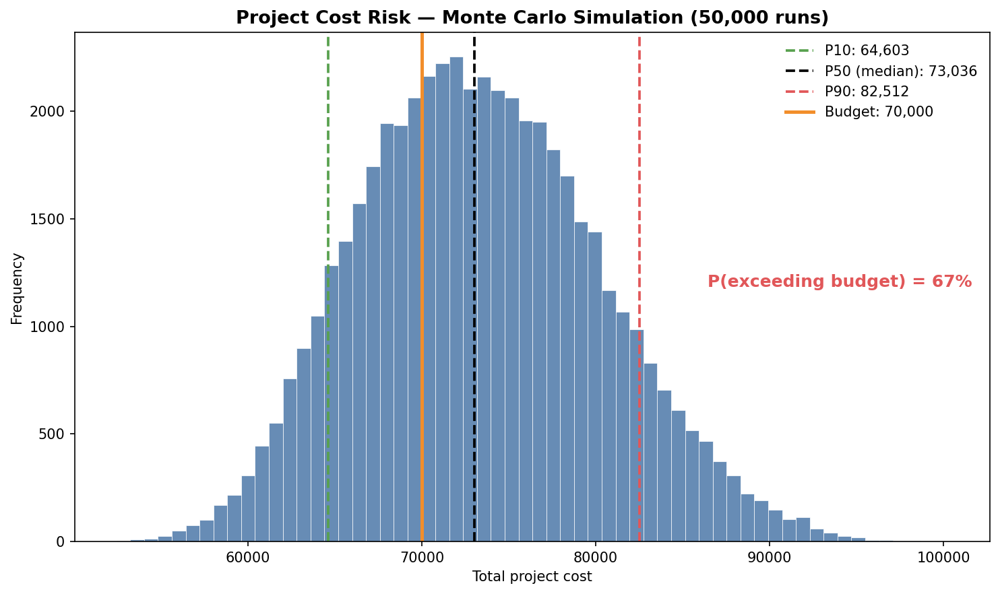
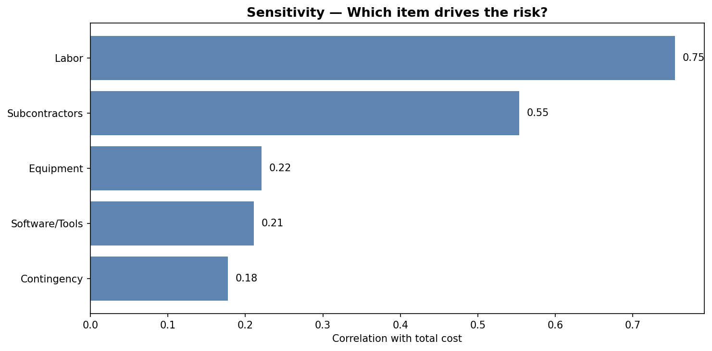

# Monte Carlo Simulation for Project Cost Risk

A **Python** notebook that estimates the total cost of a project under uncertainty using **Monte Carlo simulation** — quantifying the probability of going over budget and identifying which cost item drives the most risk.

---

## The idea

Adding up your "best guess" for each cost gives a single number that hides the risk. This simulation instead models each cost as a *range* (minimum, most likely, maximum), runs the project **50,000 times**, and reveals the full distribution of possible outcomes.

---

## Results

**Cost distribution — where the risk lives**

The simulated total cost across 50,000 runs, with P10/P50/P90 percentiles and the budget line. The annotation shows the probability of exceeding the budget — an insight a single-point estimate completely misses.

**Sensitivity — which item drives the risk**

Correlation of each cost item with the total, highlighting where to focus tighter estimates or negotiation.

---

## What it does

- Models each cost item with a **triangular distribution** from a three-point estimate
- Runs a vectorized **Monte Carlo simulation** (50,000 iterations, NumPy)
- Reports **P10 / P50 / P90** percentiles and the **probability of exceeding budget**
- Produces a **tornado sensitivity chart** to rank risk drivers

The same workflow applies to any uncertain quantity — schedules, financial forecasts, investment returns, or experimental planning.

---

## Tools

`Python` · `NumPy` · `pandas` · `matplotlib`

---

## How to run

Open `montecarlo_risk_analysis.ipynb` in **Google Colab** or Jupyter and run all cells.
No setup needed — it uses only standard scientific Python libraries.

---

## About

I'm a biologist working in bioinformatics, and I build reproducible analysis and simulation
workflows in R and Python.

Available for freelance data-analysis and simulation projects.
Connect on [LinkedIn][(https://www.linkedin.com/in/jos%C3%A9-alejandro-v%C3%A1zquez-d%C3%ADaz-0702711b5/details/featured/)].
